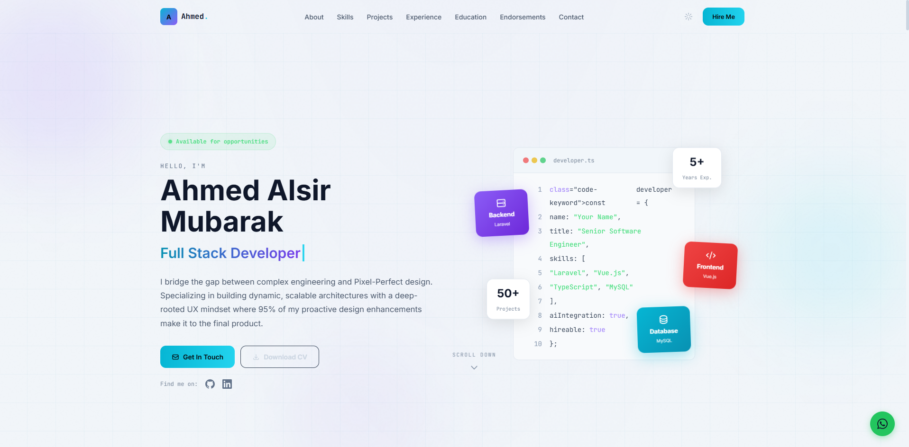
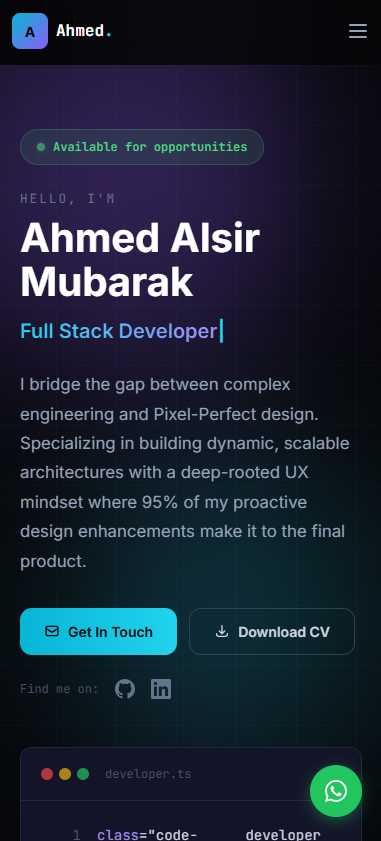
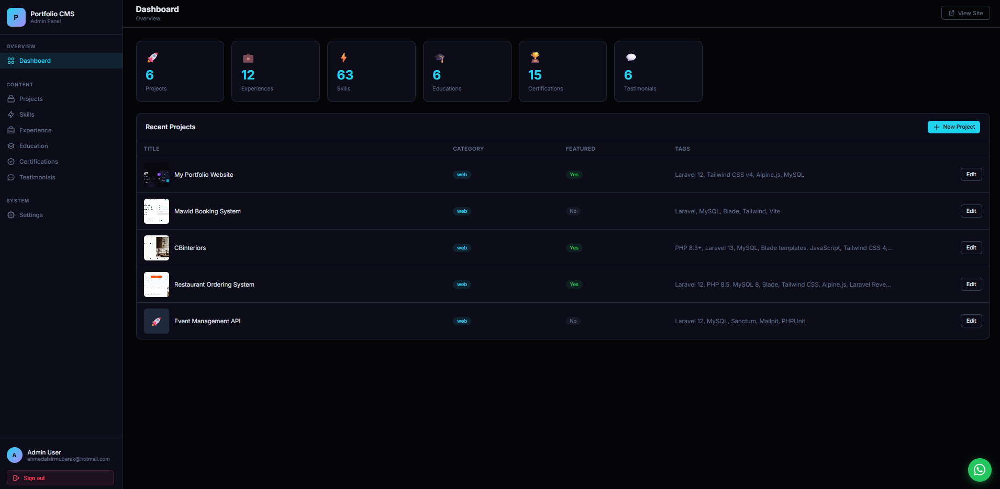
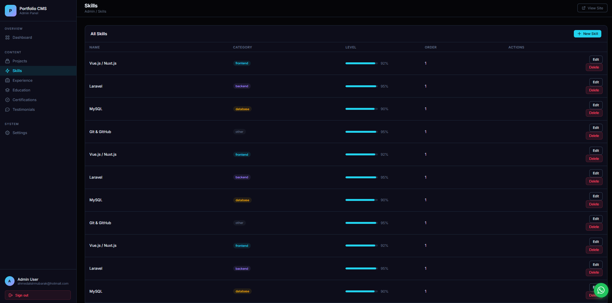
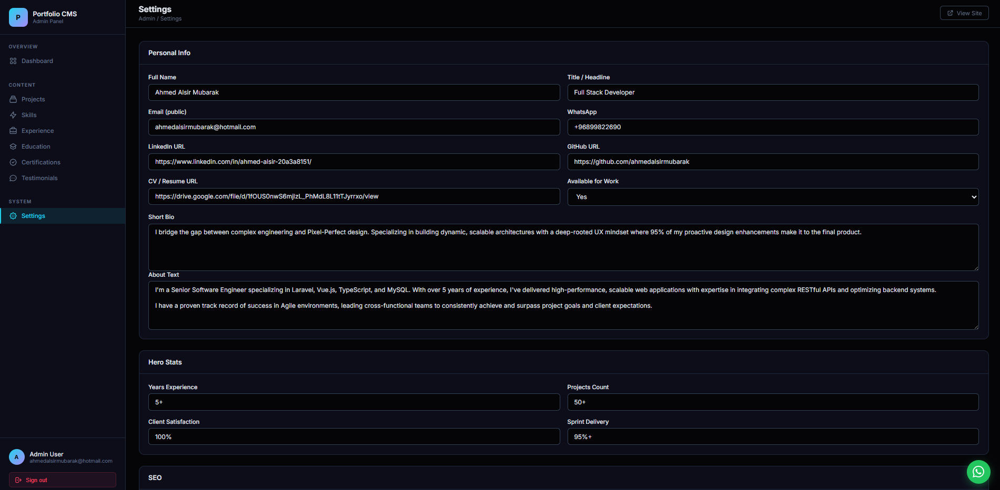

# AhmedAlsir Portfolio CMS

A full-stack developer portfolio CMS built with **Laravel 12**, featuring a custom admin dashboard, dark/light mode toggle, and fully responsive design for mobile and desktop.

---

## Screenshots

> Place your screenshots in a `screenshots/` folder at the project root, then update the paths below.

### Public Site — Dark Mode


### Public Site — Light Mode


### Mobile View


### Admin Dashboard


### Admin — Skills Management


### Admin — Settings


---

## Tech Stack

| Layer       | Technology                              |
|-------------|-----------------------------------------|
| Backend     | PHP 8.3 · Laravel 12                    |
| Frontend    | Tailwind CSS v4 · Alpine.js 3 · Vite 8 |
| Database    | MySQL (production) · SQLite (testing)   |
| Auth        | Laravel session-based authentication   |
| Testing     | PHPUnit 12 · 54 feature tests           |

---

## Features

**Public Portfolio**
- Animated hero with typing effect and floating code block
- About, Skills, Projects, Experience, Education, Certifications, Testimonials sections
- Projects archive page with category filter
- Dark / light mode toggle (persisted via `localStorage`)
- Fully responsive — no horizontal scroll on any screen size
- Smooth scroll, animated section entries

**Admin Dashboard** (`/admin`)
- Secure login / logout (session auth)
- Full CRUD for: Projects, Skills, Experiences, Education, Certifications, Testimonials
- Settings page — controls all public content (name, bio, social links, code snippet, etc.)
- Responsive admin layout with hamburger sidebar on mobile
- Custom pagination component (no Tailwind dependency in admin views)

---

## Requirements

- PHP >= 8.3
- Composer
- Node.js >= 18 & npm
- MySQL 8+

---

## Installation

```bash
# 1. Clone the repository
git clone https://github.com/your-username/AhmedAlsir-portfolio.git
cd AhmedAlsir-portfolio

# 2. Install PHP dependencies
composer install

# 3. Install JS dependencies
npm install

# 4. Create environment file
cp .env.example .env
php artisan key:generate

# 5. Configure database in .env
# DB_DATABASE=ahmedalsir_portfolio
# DB_USERNAME=root
# DB_PASSWORD=

# 6. Run migrations and seed demo data
php artisan migrate
php artisan db:seed

# 7. Build frontend assets
npm run build

# 8. Create admin user
php artisan tinker
# >>> \App\Models\User::create(['name'=>'Admin','email'=>'admin@example.com','password'=>bcrypt('password')]);
```

---

## Development

```bash
# Start all services (server + queue + logs + Vite HMR)
composer dev

# Or start individually
php artisan serve
npm run dev
```

---

## Testing

```bash
# Run all tests (uses in-memory SQLite — no DB setup needed)
php artisan test

# Or via composer script
composer test
```

All **54 feature tests** cover:
- Admin authentication (login, logout, guest guards)
- Full CRUD for all 6 resource types
- Settings update flow
- Public portfolio routes

---

## Project Structure

```
app/
  Http/Controllers/
    AdminController.php      # All admin CRUD + settings
    PortfolioController.php  # Public site pages
  Helpers/
    CodeHighlighter.php      # Syntax highlighting for code blocks
  Models/                    # Eloquent models (Project, Skill, Experience, …)

resources/
  css/app.css                # Tailwind v4 + custom dark/light CSS
  js/app.js                  # Alpine.js init + theme toggle
  views/
    components/              # Public section partials (hero, about, skills, …)
    pages/                   # home.blade.php, projects.blade.php
    layouts/app.blade.php    # Public layout (theme flash script)
    admin/                   # Admin layout + all CRUD views
    vendor/pagination/
      admin.blade.php        # Self-contained admin pagination

database/
  migrations/                # 9 migrations (settings → testimonials, users, sessions)
  seeders/DatabaseSeeder.php # Demo data for all models

routes/web.php               # Public routes + admin prefix group (42 routes)
```

---

## Environment Variables

Key variables in `.env`:

```env
APP_NAME="Portfolio"
APP_URL=http://localhost

DB_CONNECTION=mysql
DB_HOST=127.0.0.1
DB_PORT=3306
DB_DATABASE=ahmedalsir_portfolio
DB_USERNAME=root
DB_PASSWORD=

SESSION_DRIVER=database
```

---

## License

MIT
